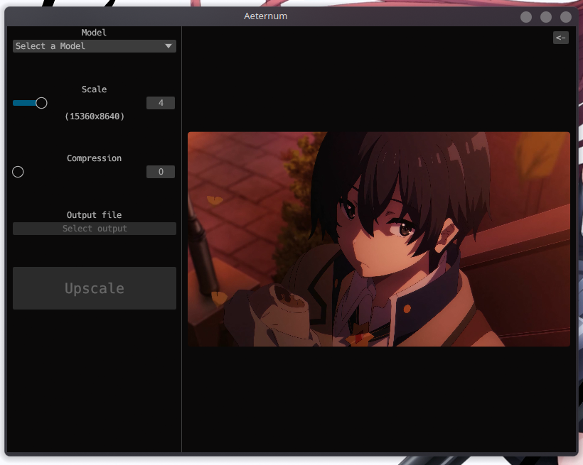

  # ∞ aeternum
  A simple and minimal upscaler built in rust

  

# What is Aeternum?
Aeternum (lt.: "Eternal") is a simple and minimal image upscaler using [`upscayl-ncnn`](https://github.com/upscayl/upscayl-ncnn) as it's backend.
Aeternum is built using [`rust`](https://www.rust-lang.org) and [`egui`](https://github.com/emilk/egui).

# 🛠️ Installation
> [!warning]
> Aeternum, along with all other cloudy-org software is very **experimental**.
> Report any bugs in the github issues tab above.

## 🪟 Windows 10+
1. Download the setup (or the zip if you want it portable) from [the newest release](https://github.com/cloudy-org/aeternum/releases/latest).
2. Run the setup/Extract the zip.
3. Run aeternum.
4. Enjoy :)

## 🐧 Linux

### Packaged
> Packaged versions of aeternum are available but they are ***third-party*** except for the AUR package. It's maintained by us.
> 
> 

### ZIP

1. Download the zip from [the newest release](https://github.com/cloudy-org/aeternum/releases/latest).
2. Extract the zip
3. `cd` into the folder and run aeternum: `./aeternum`
4. Enjoy :)

## 🍎 MacOS
WIP
